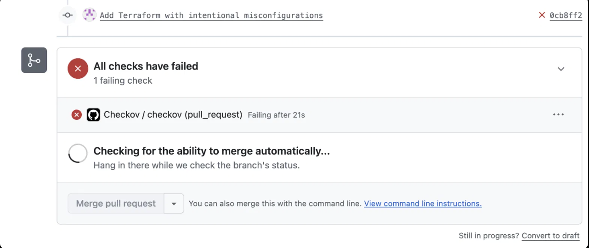
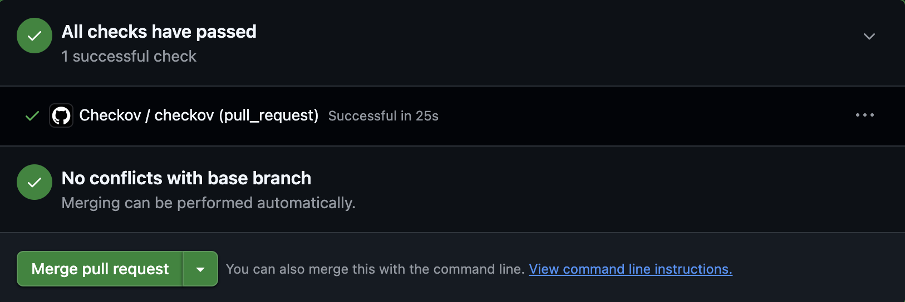

# terraform-checkov-demo
A hands-on AWS security project, demonstrating how to catch and remediate
infrastructure misconfigurations automatically, using Terraform, Checkov, and
GitHub Actions to make sure insecure infrastructure-as-code is blocked before it merges.

## Architecture

This project provisions two AWS resources with Terraform:

- **An S3 bucket** — representative of data storage in a typical application
  (backups, logs, user uploads, static assets).
- **A security group** — representative of network access control for a
  compute resource (e.g. an EC2 instance).

Both resources start in a deliberately insecure state, are scanned by
Checkov, and are then remediated based on the scanner's findings.

## Threat model

Cloud misconfigurations are one of the most common causes of real-world
breaches, not because attackers use novel techniques, but because
default-open settings and skipped steps are easy to miss at scale:

- **A public S3 bucket** can expose sensitive data to anyone on the internet
  with no authentication required — several major breaches have traced back
  to exactly this: a bucket that was made public temporarily (for a demo, a
  quick share, a debugging session) and never locked back down.
- **An open SSH ingress rule (`0.0.0.0/0` on port 22)** allows any host on
  the internet to attempt to connect to port 22 on the associated instance.
  Combined with a weak password or an exposed key, this invites constant automated
  scanning and brute-force traffic.
- **Missing encryption at rest** means that if bucket data is ever exposed
  or accessed outside the intended path (misconfigured policy, compromised
  credentials), there's no additional layer protecting the data.

This project treats policy-as-code scanning as a way to catch these classes
of misconfiguration automatically, before they reach a running environment,
rather than relying on manual review to catch every case.

## CI in action

**Pull request blocked by a failing Checkov scan:**

**Same pull request, after remediation, passing cleanly:**

## Findings and remediations

| Check | What it checks | Fix applied |
|---|---|---|
| `CKV_AWS_53` | S3 bucket blocks public ACLs | Set `block_public_acls = true` |
| `CKV_AWS_54` | S3 bucket blocks public bucket policies | Set `block_public_policy = true` |
| `CKV_AWS_55` | S3 bucket ignores public ACLs | Set `ignore_public_acls = true` |
| `CKV_AWS_56` | S3 bucket restricts public bucket access | Set `restrict_public_buckets = true` |
| `CKV_AWS_24` | Security group doesn't allow SSH from `0.0.0.0/0` | Restricted `cidr_blocks` to a single admin CIDR |
| `CKV_AWS_23` | Every security group/rule has a description | Added descriptive `description` fields |
| `CKV2_AWS_65` | S3 bucket ACLs are disabled | Switched ownership controls to `BucketOwnerEnforced`, removed ACL resource |
| `CKV_AWS_21` | S3 bucket has versioning enabled | Added `aws_s3_bucket_versioning` resource |
| `CKV_AWS_145` | S3 bucket encrypted with KMS | Added `aws_kms_key` + `aws_s3_bucket_server_side_encryption_configuration` |
| `CKV2_AWS_64` | KMS key has an explicit policy | Added an explicit key policy scoped to the account root principal |
| `CKV2_GHA_1` | Workflow sets top-level permissions, not write-all | Added top-level `permissions: contents: read` |

## Intentionally skipped checks

A few checks were left failing, with reasons documented inline via
`#checkov:skip` comments in `main.tf`, rather than implemented, since they
require infrastructure out of scope for this demo:

| Check | What it checks | Why it's skipped |
|---|---|---|
| `CKV_AWS_144` | S3 cross-region replication | Not needed for a single-region demo bucket |
| `CKV2_AWS_61` | S3 lifecycle configuration | No lifecycle requirements for an empty demo bucket |
| `CKV2_AWS_62` | S3 event notifications | No event consumers in this demo |
| `CKV_AWS_18` | S3 access logging | Requires a separate logging bucket, out of scope here |
| `CKV2_AWS_5` | Security group attached to a resource | Demo security group isn't attached to an instance |

In a production environment, several of these (especially access logging
and lifecycle rules) would likely be implemented rather than skipped. Their
absence here is a scoping decision, documented for reviewers rather than
silently ignored.
